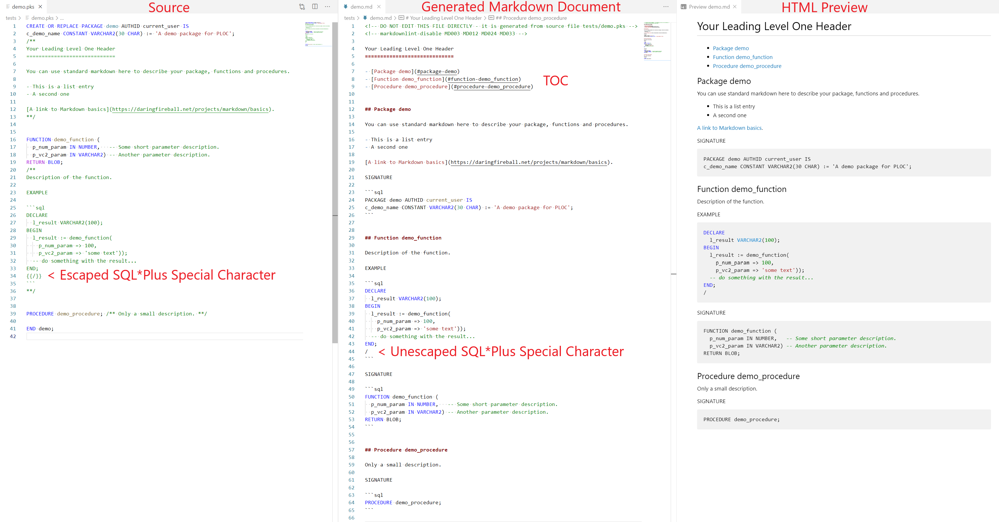

<!-- markdownlint-disable MD012 MD048 -->

# PLOC - PL/SQL code to doc converter

<!-- toc -->

- [Description](#description)
- [FAQ](#faq)
- [Installation](#installation)
- [Example for a single file](#example-for-a-single-file)
- [Example for multiple files](#example-for-multiple-files)
- [Automation with a file watcher](#automation-with-a-file-watcher)
- [Read more about npm scripts](#read-more-about-npm-scripts)
- [SQL\*Plus Special Characters](#sqlplus-special-characters)
- [Markdown Headers](#markdown-headers)
- [Changelog](#changelog)

<!-- tocstop -->



## Description

PLOC is a simple PL/SQL code to doc converter which supports comments written in Markdown and generates Markdown files ready to use for your documentation. It is a npm package and therefore written in JavaScript. Simple means here really simple - the converter is only about 120 lines of commented code. Here a short demo package spec which demonstrates the idea behind PLOC:

~~~sql
CREATE OR REPLACE PACKAGE demo AUTHID current_user IS
c_demo_name CONSTANT VARCHAR2(30 CHAR) := 'A demo package for PLOC';
/**
Your Leading Level One Header
=============================

You can use standard markdown here to describe your package, functions and procedures.

- This is a list entry
- A second one

[A link to Markdown basics](https://daringfireball.net/projects/markdown/basics).
**/


FUNCTION demo_function (
  p_num_param IN NUMBER,   -- Some short parameter description.
  p_vc2_param IN VARCHAR2) -- Another parameter description.
RETURN BLOB;
/**
Description of the function.

EXAMPLE

```sql
DECLARE
  l_result VARCHAR2(100);
BEGIN
  l_result := demo_function(
    p_num_param => 100,
    p_vc2_param => 'some text'));
  -- do something with the result...
END;
{{/}}
```
**/

END demo;
~~~

- The converter picks up everything between the keywords PACKAGE, FUNCTION, PROCEDURE, TYPE or TRIGGER and a following PL/SQL multiline comment starting with `/**` and ending with `**/` (the double stars are used to support normal multiline comments)
- Anything else is ignored - if you want to include something in your docs, you have to provide a comment in the mentioned style after the relevant signature
- In the comments you can provide standard Markdown - anything what the target system (GitHub for example) can convert to valid HTML (we do not generate the HTML here, only the Markdown file)
- In the example above the constant `c_demo_name` is included in the docs - if you don't want this move the code behind the comment - you decide which globals are documented and which not
- There is no parameter parsing: the converter prints for each item the following informations
  - A header (`# Package demo` or `## FUNCTION demo_function` in our example)
  - The comment content
  - A paragraph containing the word `SIGNATURE`
  - The signature of the PACKAGE, FUNCTION, PROCEDURE, TYPE or TRIGGER wrapped in a code block
  - Depending on the number of items (configurable) a TOC is generated in front of the document
  - A "Do not edit directly..." HTML comment with the source file path info is also generated on top of the file
- A leading level one header in the first comment (usually the package description) is used as the overall document header

Many words... Here the converted output of our example package:

~~~md
<!-- DO NOT EDIT THIS FILE DIRECTLY - it is generated from source file tests/demo.pks -->

Your Leading Level One Header
=============================

Package demo
------------

You can use standard markdown here to describe your package, functions and procedures.

- This is a list entry
- A second one

[A link to Markdown basics](https://daringfireball.net/projects/markdown/basics).

SIGNATURE

```sql
PACKAGE demo AUTHID current_user IS
c_demo_name CONSTANT VARCHAR2(30 CHAR) := 'A demo package for PLOC';
```


Function demo_function
----------------------

Description of the function.

EXAMPLE

```sql
DECLARE
  l_result VARCHAR2(100);
BEGIN
  l_result := demo_function(
    p_num_param => 100,
    p_vc2_param => 'some text'));
  -- do something with the result...
END;
/
```

SIGNATURE

```sql
FUNCTION demo_function (
  p_num_param IN NUMBER,   -- Some short parameter description.
  p_vc2_param IN VARCHAR2) -- Another parameter description.
RETURN BLOB;
```
~~~

For a bigger example see the following two projects which are using PLOC for the generation of the README.md file:

- [PL/SQL Export Utilities][plex]
  - [The package source code][plexSpec]
  - [The raw Markdown file generated by PLOC][plexReadme]
  - [The README file rendered as HTML by GitHub][plexReadmeHTML]
- [Oracle Table API Generator][tapigen]
  - [The package source code][tapigenSpec]
  - [The raw Markdown file generated by PLOC][tapigenReadme]
  - [The README file rendered as HTML by GitHub][tapigenReadmeHTML]

[plex]: https://github.com/ogobrecht/plex
[plexSpec]: https://github.com/ogobrecht/plex/blob/master/PLEX.pks
[plexReadme]: https://raw.githubusercontent.com/ogobrecht/plex/master/README.md
[plexReadmeHTML]: https://github.com/ogobrecht/plex/blob/master/README.md
[tapigen]: https://github.com/OraMUC/table-api-generator
[tapigenSpec]: https://github.com/OraMUC/table-api-generator/blob/master/OM_TAPIGEN.pks
[tapigenReadme]: https://raw.githubusercontent.com/OraMUC/table-api-generator/master/README.md
[tapigenReadmeHTML]: https://github.com/OraMUC/table-api-generator/blob/master/README.md


## FAQ

QUESTION: Why no JavaDoc compatible parameter desriptions?

ANSWER: In my opinion this does NOT follow the DRY principle and is error prone. PL/SQL is a strong typed language. Anything you need to know is visible in the signature. There is no need to repeat the parameters in a formal way only to comment a little bit. For short comments you can put single line comments direct after the parameters (see  function `demo_function` in the example above). If you need to write more refer to the Markdown main comment. On long parameter lists you will more easily follow the single line comments direct after the parameters then looking around between the signature and the formal JavaDoc comments.

QUESTION: Why do I need to put the comments below the signature?

ANSWER: If we put the comments before the signature the PL/SQL compiler will strip out the comment - at least for the comment of the package itself or a standalone function, procedure or trigger. If you then get the DDL of your objects out of the database with dbms_metadata you will lose these first comments. This will be no problem if you follow the files first approach together with a version control system but who knows in what ways your code will be inspected? It would be nice for the reviewers to get all provided comments.


## Installation

In your repo install ploc:

```js
npm install ploc
```


## Example for a single file

Add a new npm script entry in your package.json - here an example from my PLEX project - we call it `build:docs`:

```js
{
  "name": "plex",
  "scripts": {
    "build:docs": "npx ploc --in PLEX.pks --out README.md",
  },
  "dependencies": {
    "ploc": "^0.6.1"
  }
}
```

Notes:

- [npx](https://blog.npmjs.org/post/162869356040/introducing-npx-an-npm-package-runner) is a npm command to run locally installed packages with a command line interface and is available since npm 5.2.0
- ploc provides a cli
- We use only two of our possible three parameters: for the help run `npx ploc --help` or `npx ploc -h`

```bash
> npx ploc --help

Usage: ploc [options]

  -i, --in:     The glob pattern for the code files to read
                (default is "**/*.pks")

  -o, --out:    The pattern for the doc files to write
                (default is "{folder}{file}.md")
                {folder} = in file path with trailing directory separator
                {file} = in file name without extension

  -t, --toc:    How many items (methods including object/package name) the
                code must have before a toc is included
                (default is 3)

  -h, --help:   Command line help

  -d, --debug:  Write CLI arguments to console

Example 1: npx ploc --in '**/*.pks' --out {folder}{file}.md
Example 2: npx ploc --out docs/{file}.md
Example 3: npx ploc -i '**/*.*(pks|sql)' -o docs/{file}.md -t 5
https://blog.npmjs.org/post/162869356040/introducing-npx-an-npm-package-runner
```

Running the script:

```sh
npm run build:docs
```

The output will be something like this:

```sh
> plex@ build:docs /Users/ottmar/code/plex
> npx ploc --in PLEX.pks --out README.md

PLEX.pks => README.md
```

For each generated Markdown document you get one log entry with the input and output file - here we have only one entry: `PLEX.pks => README.md`


## Example for multiple files

We add now a script called `build:all_docs` to our package.json:

```js
{
  "name": "plex",
  "scripts": {
    "build:docs": "npx ploc --in PLEX.pks --out README.md",
    "build:all_docs": "npx ploc",
  },
  "dependencies": {
    "ploc": "^0.6.1"
  }
}
```

As you can see we omit simply all parameters and therefore the defaults are used (in = `**/*.pks`, out = `{folder}{file}.md`), which results in converting all found `*.pks` files in all directories and subdirectories. Here the output of this conversion:

```sh
> plex@ build:all_docs /Users/ottmar/code/plex
> npx ploc

PLEX.pks => PLEX.md
src/test_1.pks => src/test_1.md
src/test_2.pks => src/test_2.md
```

Obviously I have some test files in the `src` folder. You can also see on this example that you can use the variables `{folder}` (directory path of source file with trailing directory separator) and `{file}` (source file name without extension) in your `out` parameter. The `ìn` parameter is a standard [glob file pattern](https://github.com/isaacs/node-glob#glob).

GLOB COMMENTS: If you use wildcards in your `in` parameter and you have the feeling it does not work, then try to wrap the parameter in single or double quotes. Depending on your operating system the shell already expands the wildcard characters and ploc gets only the first match - you can debug the arguments by providing `-d` or `--debug` to the call like so: `npx ploc -d -i 'tests/*.*(pks|sql)'` (process all \*.pks and \*.sql files in dir tests). For Windows users: Please use only the forward slash as a directory separator in your glob patterns!

One common use case is to place all docs in a docs folder - we change therefore our `build:all_docs` script:

```js
{
  "name": "plex",
  "scripts": {
    "build:docs": "npx ploc --in PLEX.pks --out README.md",
    "build:all_docs": "npx ploc --out docs/{file}.md",
  },
  "dependencies": {
    "ploc": "^0.6.1"
  }
}
```

Note that the target directory `docs` must already exist - otherwise npm will throw an error. The resulting output should something like this:

```sh
> plex@ build:all_docs /Users/ottmar/code/plex
> npx ploc --out docs/{file}.md

PLEX.pks => docs/PLEX.md
src/test_1.pks => docs/test_1.md
src/test_2.pks => docs/test_2.md
```


## Automation with a file watcher

We use here [chokidar](https://www.npmjs.com/package/chokidar-cli) - you can install it with `npm install chokidar-cli`. Then we create a watch script entry - here it is named `watch:docs`.

```js
{
  "name": "plex",
  "scripts": {
    "build:docs": "npx ploc --in PLEX.pks --out README.md",
    "watch:docs": "chokidar PLEX.pks package.json --initial -c \"npm run build:docs\""
  },
  "dependencies": {
    "chokidar-cli": "^1.2.1",
    "ploc": "^0.6.1"
  }
}
```

Notes:

- `chokidar PLEX.pks package.json` the files to watch (or glob patterns) are listed with a whitspace character as a separator
- `--initial` tells the watcher to run the script on start
- `-c \"npm run build:docs\""` is the command to run when one of the watched files changes - the escaped double quotes are important for windows

To start the watcher you run this:

```sh
npm run watch:docs
```

Here the output after the start:

```sh
> plex@ watch:docs /Users/ottmar/code/plex
> chokidar PLEX.pks package.json --initial -c "npm run build:docs"

add:PLEX.pks
add:package.json
Watching "PLEX.pks", "package.json" ..

> plex@ build:docs /Users/ottmar/code/plex
> npx ploc --in PLEX.pks --out README.md

PLEX.pks => README.md
```

The terminal is blocked because of the running watcher - after a file change you will see something like this:

```sh
change:PLEX.pks

> plex@ build:docs /Users/ottmar/code/plex
> npx ploc --in PLEX.pks --out README.md

PLEX.pks => README.md
```


## Read more about npm scripts

- [Introduction to NPM Scripts](https://medium.freecodecamp.org/introduction-to-npm-scripts-1dbb2ae01633)
- [Why I Left Gulp and Grunt for npm Scripts](https://medium.freecodecamp.org/why-i-left-gulp-and-grunt-for-npm-scripts-3d6853dd22b8)
- [Why npm Scripts?](https://css-tricks.com/why-npm-scripts/)


## SQL\*Plus Special Characters

`/`, `#` and `@` are special SQL\*Plus characters. If they occur as the first
character in a line then SQL\*Plus does some special functionality - independend
from the occurence inside a comment or a string literal. So be warned - the
minimum problem you will get is that compiling PL/SQL code in an SQL\*Plus script
will fail. The maximum problem under some circumstances is the [lost of data][example].

To avoid these problems we have to escape the characters like so: `{{/}} {{#}} {{@}}`.
PLOC does unescape these characters when generating your markdown docs.

[example]: http://www.oraclefindings.com/2016/08/16/sql-plus-hash-pound/


## Markdown Headers

The generated doc is already structured with level one and level two headers. If you want
to use Markdown headers in your comments then please use level three to level six headers.
Please beware of the potential SQL\*Plus issues described above. To avoid these you have
to escape the first hash character like so:

```md
{{#}}## Level 3 Header
{{#}}### Level 4 Header
{{#}}#### Level 5 Header
{{#}}##### Level 6 Header
```


## Changelog

### 0.6.3 - 2021-03-13

- Fixed: TOC links only working with generated HTML header IDs
- Fixed: TOC Links to overloaded functions and procedures are not working
- Use pure Markdown for the headers since many Markdown processors automatically generate header IDs - for example in VS Code it is working out of the box and GitHub does it also

### 0.6.2 - 2020-10-10

- Fixed: Add a markdownlint configuration on top of each generated file to get no warnings for rules MD003, MD012, MD033 (also see issue [#5](https://github.com/ogobrecht/ploc/issues/5))

### 0.6.1 - 2018-06-20

- Fixed: Escaped SQL\*Plus special characters are now replaced globally


### 0.6.0 - 2018-06-20

- Improved generated document structure
  - A leading level one header in the first comment (usually the package description) is used as the overall document header
  - An eventually rendered TOC is following this overall header
- PLOC does now unescape escaped special SQL\*Plus characters (see section "SQL\*Plus Special Characters")
- Changed minimum number of items to render a TOC from 4 to 3


### 0.5.0 - 2018-12-23

- Add "Do not edit..." message to generated files
- Add `debug` param to CLI for parsed arguments
- Improved README regarding glob patterns
- Internal renamings


### 0.4.1 - 2018-12-18

- Fixed: parsing regex breaks when keywords `package`, `function`, `procedure`, `trigger` or `type` found in a signature (not the starting one, sure, but in a line comment or type declaration)
  - example with two problems: `demo_param my_table.my_column%TYPE --A cool function param`
- New (manual) test script


### 0.4.0 - 2018-12-15

- Add CLI
- Add TOC to README
- Changelog back into the README (feels more natural since we have now a TOC here)


### 0.3.2 - 2018-11-25

Docs only: Corrections to the readme and an additional changelog file.


### 0.3.1 - 2018-11-21

After some private usage and the initial push to npmjs.com here the first public release.

Happy coding and documenting\
Ottmar
